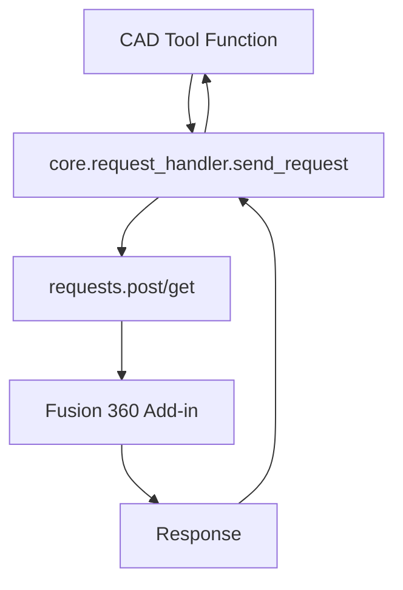
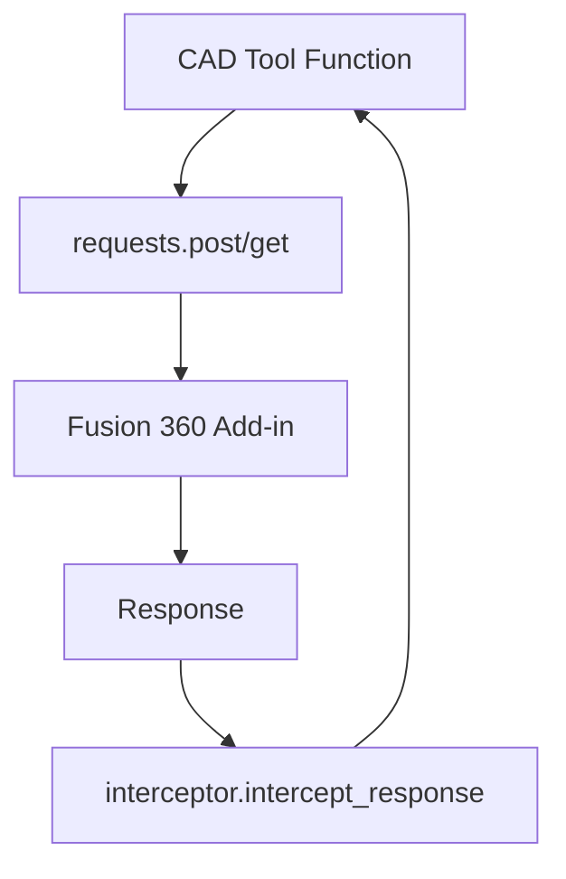

# Design Document

## Overview

This design document outlines the modernization of CAD tools in the Fusion 360 MCP Server to use the current HTTP request pattern. The modernization will transform 25 functions across 4 files from using the deprecated `send_request` wrapper to the modern direct `requests` approach with response interception.

## Architecture

### Current Architecture (Old Pattern)



**Issues with Current Architecture:**
- Extra abstraction layer through `send_request` wrapper
- Inconsistent with CAM tools pattern
- No response interception support
- Uses deprecated `get_headers()` function
- Different error handling patterns

### Target Architecture (Modern Pattern)



**Benefits of Target Architecture:**
- Direct HTTP requests without unnecessary wrapper
- Consistent with CAM tools pattern
- Built-in response interception for debugging
- Standardized error handling
- Cleaner dependencies

## Components and Interfaces

### HTTP Request Interface

**Modern Pattern Template:**
```python
def tool_function(param1: type, param2: type) -> dict:
    """Tool description."""
    try:
        endpoint = get_endpoints("cad")["endpoint_name"]
        
        # For GET requests
        response = requests.get(endpoint, timeout=get_timeout())
        
        # For POST requests  
        data = {"param1": param1, "param2": param2}
        response = requests.post(endpoint, json=data, timeout=get_timeout())
        
        return interceptor.intercept_response(endpoint, response, "GET|POST")
        
    except requests.ConnectionError:
        return {
            "error": True,
            "message": "Cannot connect to Fusion 360. Ensure the add-in is running.",
            "code": "CONNECTION_ERROR"
        }
    except requests.Timeout:
        return {
            "error": True,
            "message": "Request to Fusion 360 timed out. The add-in may be busy.",
            "code": "TIMEOUT_ERROR"
        }
    except Exception as e:
        logging.error("Tool function failed: %s", e)
        return {
            "error": True,
            "message": f"Failed to execute tool: {str(e)}",
            "code": "UNKNOWN_ERROR"
        }
```

### Import Interface

**Old Imports (to be removed):**
```python
from core.request_handler import send_request
from core.config import get_endpoints, get_headers
```

**New Imports (to be added):**
```python
import requests
from core.config import get_endpoints, get_timeout
from core import interceptor
```

### Error Handling Interface

**Standardized Error Response Format:**
```python
{
    "error": True,
    "message": "Human-readable error description",
    "code": "ERROR_CODE_CONSTANT"
}
```

**Standard Error Codes:**
- `CONNECTION_ERROR`: Cannot connect to Fusion 360 add-in
- `TIMEOUT_ERROR`: Request timed out
- `UNKNOWN_ERROR`: Unexpected error occurred

## Data Models

### Function Transformation Mapping

| File | Functions | HTTP Method | Endpoint Pattern |
|------|-----------|-------------|------------------|
| `geometry.py` | `draw_cylinder`, `draw_box`, `draw_sphere` | POST | `cad["draw_*"]` |
| `sketching.py` | `draw2Dcircle`, `draw_lines`, `draw_one_line`, `draw_arc`, `spline` | POST | `cad["draw_*"]` |
| `modeling.py` | `extrude`, `extrude_thin`, `cut_extrude`, `revolve`, `loft`, `sweep`, `boolean_operation`, `draw_2d_rectangle`, `draw_text` | POST | `cad["*"]` |
| `features.py` | `fillet_edges`, `draw_holes`, `shell_body`, `circular_pattern`, `rectangular_pattern`, `create_thread`, `ellipsie`, `draw_witzenmannlogo` | POST | `cad["*"]` or `utility["*"]` |

### Request Data Structure

**Before (Old Pattern):**
```python
payload = {"param1": value1, "param2": value2}
headers = get_headers()
return send_request(endpoint, payload, headers)
```

**After (Modern Pattern):**
```python
data = {"param1": value1, "param2": value2}
response = requests.post(endpoint, json=data, timeout=get_timeout())
return interceptor.intercept_response(endpoint, response, "POST")
```

### Response Processing

**Response Interception Flow:**
1. HTTP request made with `requests.get/post`
2. Response received from Fusion 360 add-in
3. Response passed to `interceptor.intercept_response`
4. Interceptor logs response if debugging enabled
5. Interceptor returns processed response to caller

## Correctness Properties

*A property is a characteristic or behavior that should hold true across all valid executions of a system-essentially, a formal statement about what the system should do. Properties serve as the bridge between human-readable specifications and machine-verifiable correctness guarantees.*

Let me analyze the acceptance criteria for testable properties:

<function_calls>
<invoke name="prework">
<parameter name="featureName">cad-tools-modernization

### Property Reflection

After reviewing all the properties identified in the prework, I need to eliminate redundancy and consolidate related properties:

**Redundancy Analysis:**
- Properties 1.1, 1.2, 6.1, 6.2, 6.3 all test the same core pattern - can be consolidated into one comprehensive pattern property
- Properties 1.4, 1.5, 5.1, 5.2, 5.3, 5.4, 5.5 all test import statements - can be consolidated into one import property
- Properties 3.1, 3.2, 3.3 all test error handling - can be consolidated into one error handling property
- Properties 7.1, 7.2, 7.3, 7.4, 7.5 all test file coverage - can be consolidated into one coverage property
- Properties 4.2, 4.3, 4.4 all test interceptor usage - can be consolidated with 4.1 into one interceptor property

**Consolidated Properties:**

Property 1: Modern HTTP Request Pattern
*For any* CAD tool function, the implementation should use direct `requests.get/post` calls with `interceptor.intercept_response` and proper timeout handling
**Validates: Requirements 1.1, 1.2, 6.1, 6.2, 6.3**

Property 2: Import Statement Modernization  
*For any* CAD tool file, the imports should include `requests`, `get_endpoints`, `get_timeout`, and `interceptor` while excluding `send_request` and `get_headers`
**Validates: Requirements 1.4, 1.5, 5.1, 5.2, 5.3, 5.4, 5.5**

Property 3: Functional Compatibility Preservation
*For any* CAD tool function, calling it with the same parameters should produce identical results before and after modernization
**Validates: Requirements 2.1, 2.2, 2.3, 2.4, 2.5**

Property 4: Standardized Error Handling
*For any* CAD tool function, error conditions should return responses with consistent structure containing error, message, and code fields
**Validates: Requirements 1.3, 3.1, 3.2, 3.3, 3.4, 3.5**

Property 5: Response Interceptor Integration
*For any* CAD tool HTTP request, the response should be processed through `interceptor.intercept_response` with correct endpoint, response, and method parameters
**Validates: Requirements 4.1, 4.2, 4.3, 4.4, 4.5**

Property 6: Complete File Coverage
*For all* CAD tool files (geometry.py, sketching.py, modeling.py, features.py), every function should be modernized to use the new pattern
**Validates: Requirements 7.1, 7.2, 7.3, 7.4, 7.5**

Property 7: End-to-End Compatibility
*For any* modernized CAD tool, it should load successfully in the MCP server and produce the same results when called through MCP
**Validates: Requirements 8.1, 8.2, 8.3, 8.4, 8.5**

## Error Handling

### Exception Hierarchy

```python
try:
    # HTTP request logic
    pass
except requests.ConnectionError:
    # Handle connection failures
    return connection_error_response()
except requests.Timeout:
    # Handle timeout failures  
    return timeout_error_response()
except requests.RequestException as e:
    # Handle other HTTP errors
    logging.error("HTTP request failed: %s", e)
    return unknown_error_response(str(e))
except Exception as e:
    # Handle unexpected errors
    logging.error("Unexpected error: %s", e)
    return unknown_error_response(str(e))
```

### Error Response Templates

```python
def connection_error_response():
    return {
        "error": True,
        "message": "Cannot connect to Fusion 360. Ensure the add-in is running.",
        "code": "CONNECTION_ERROR"
    }

def timeout_error_response():
    return {
        "error": True,
        "message": "Request to Fusion 360 timed out. The add-in may be busy.",
        "code": "TIMEOUT_ERROR"
    }

def unknown_error_response(error_msg):
    return {
        "error": True,
        "message": f"Failed to execute operation: {error_msg}",
        "code": "UNKNOWN_ERROR"
    }
```

## Testing Strategy

### Dual Testing Approach

The testing strategy combines unit tests for specific functionality with property-based tests for universal behaviors:

**Unit Tests:**
- Test specific CAD tool functions with known inputs
- Verify error handling for connection failures and timeouts
- Test response format consistency
- Validate import statement changes

**Property-Based Tests:**
- Test that all CAD tools follow the modern pattern (minimum 100 iterations)
- Test that function signatures are preserved across modernization
- Test that error responses have consistent structure
- Test that interceptor integration works for all tools

**Property Test Configuration:**
- Each property test runs minimum 100 iterations due to randomization
- Tests tagged with: **Feature: cad-tools-modernization, Property {number}: {property_text}**
- Property tests reference their corresponding design document property

### Integration Testing

**HTTP Endpoint Testing:**
- Direct HTTP calls to Fusion 360 add-in endpoints
- Verify that modernized tools produce same responses as before
- Test response interception functionality

**MCP Server Testing:**
- Load all modernized CAD tools in MCP server
- Verify tools register correctly without import errors
- Test end-to-end MCP calls produce expected results

### Validation Checklist

**Pre-Modernization:**
- [ ] Document current behavior of all 25 CAD tool functions
- [ ] Capture sample requests/responses for comparison
- [ ] Verify current error handling patterns

**Post-Modernization:**
- [ ] All imports updated to modern pattern
- [ ] All HTTP requests use direct `requests` calls
- [ ] All responses processed through interceptor
- [ ] Error handling follows standardized pattern
- [ ] Function signatures preserved
- [ ] Docstrings and comments maintained
- [ ] All tools load in MCP server without errors
- [ ] Response interception works for debugging

### Test Implementation

**Property Test Example:**
```python
@given(cad_tool_function=st.sampled_from(ALL_CAD_FUNCTIONS))
def test_modern_pattern_usage(cad_tool_function):
    """
    Feature: cad-tools-modernization, Property 1: Modern HTTP Request Pattern
    For any CAD tool function, the implementation should use direct requests calls
    """
    source_code = inspect.getsource(cad_tool_function)
    
    # Verify modern pattern usage
    assert "requests.get(" in source_code or "requests.post(" in source_code
    assert "interceptor.intercept_response(" in source_code
    assert "get_timeout()" in source_code
    
    # Verify old pattern removal
    assert "send_request(" not in source_code
    assert "get_headers()" not in source_code
```

This comprehensive testing strategy ensures that the modernization maintains functional compatibility while successfully implementing the new patterns across all CAD tools.