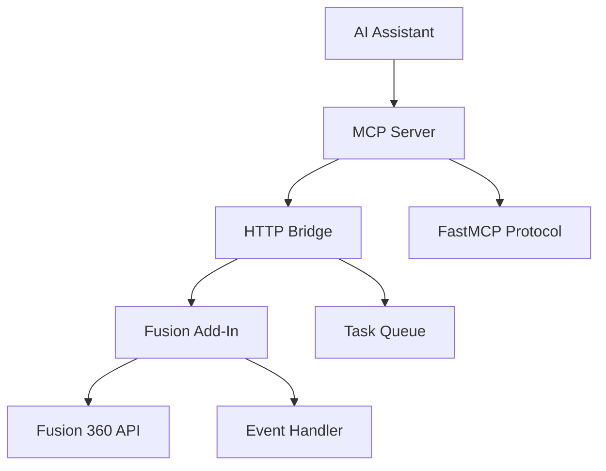

# Fusion MCP Manufacturing Integration

[](https://opensource.org/licenses/MIT)
[](https://www.python.org/downloads/)

Bridge AI assistants with Autodesk Fusion 360's MANUFACTURE workspace through conversational CAM commands.

## What Problem Does This Solve?

Learning CAM can be overwhelming with complex workflows, tool selection decisions, and feeds/speeds calculations. This project was created to provide:

- **CAM Learning Assistant**: AI mentor to guide through manufacturing workflows and best practices
- **Feeds & Speeds Helper**: Intelligent assistance with cutting parameters and optimization
- **Tool Selection Guidance**: Smart recommendations for cutting tools based on materials and operations
- **Conversational CAM**: Learn and manage CAM operations through natural language interaction

## Tech Stack

- **Python 3.10+** - Core runtime and MCP server
- **FastMCP** - Model Context Protocol server implementation
- **Uvicorn** - ASGI server for HTTP transport
- **Fusion 360 CAM API** - Manufacturing operations and tool library access

## Requirements

| Component | Version | Installation |
|-----------|---------|--------------|
| Python | 3.10+ | [python.org](https://python.org) |
| uv | Latest | [docs.astral.sh/uv](https://docs.astral.sh/uv/getting-started/installation/) |
| Autodesk Fusion 360 | Current | [autodesk.com/fusion360](https://autodesk.com/fusion360) |
| AI Assistant | - | See setup sections below |

## Installation

### 1. Clone Repository

```bash
git clone https://github.com/JustusBraitinger/FusionMCP
cd FusionMCP
```

### 2. Install Dependencies

```bash
uv sync
```

This creates a virtual environment and installs all required dependencies with locked versions.

### 3. Install Fusion 360 Add-In

**For Development (Recommended):**
```bash
uv run install-fusion-plugin --dev
```

**For Distribution:**
```bash
uv run install-fusion-plugin
```

The `--dev` flag creates a symbolic link for live editing without reinstalling after code changes.

## Setup for AI Assistants

### Kiro CLI Setup

Create or edit your Kiro agent configuration file:

```json
{
  "mcpServers": {
    "FusionMCP": {
      "command": "uv",
      "args": [
        "--directory",
        "/Users/yourname/path/to/FusionMCP",
        "run",
        "python3",
        "Server/MCP_Server.py",
        "--server_type",
        "stdio"
      ]
    }
  },
  "allowedTools": ["@FusionMCP/*"]
}
```

Replace `/Users/yourname/path/to/FusionMCP` with your actual project path.

### Claude Desktop Setup

1. Open Claude Desktop
2. Go to **Settings → Developer → Edit Config**
3. Add the MCP server configuration:

**macOS:**
```json
{
  "mcpServers": {
    "FusionMCP": {
      "command": "uv",
      "args": [
        "--directory",
        "/Users/yourname/path/to/FusionMCP",
        "run",
        "python3",
        "Server/MCP_Server.py",
        "--server_type",
        "stdio"
      ]
    }
  }
}
```

**Windows:**
```json
{
  "mcpServers": {
    "FusionMCP": {
      "command": "uv",
      "args": [
        "--directory",
        "C:\\Users\\yourname\\path\\to\\FusionMCP",
        "run",
        "python3",
        "Server/MCP_Server.py",
        "--server_type",
        "stdio"
      ]
    }
  }
}
```

**Alternative using fastmcp:**
```bash
uv run fastmcp install Server/MCP_Server.py --name Fusion
```

### VS Code Copilot Setup

VS Code requires HTTP transport. Start the server manually:

```bash
uv run start-mcp-server --sse
```

Create or edit the MCP configuration file:

**Windows:** `%APPDATA%\Code\User\globalStorage\github.copilot-chat\mcp.json`  
**macOS:** `~/Library/Application Support/Code/User/globalStorage/github.copilot-chat/mcp.json`

```json
{
  "servers": {
    "FusionMCP": {
      "url": "http://127.0.0.1:8000/sse",
      "type": "http"
    }
  },
  "inputs": []
}
```

**Alternative VS Code Setup:**
1. Press **Ctrl+Shift+P** (or **Cmd+Shift+P** on macOS)
2. Search "MCP" → select "Add MCP"
3. Choose "HTTP"
4. Enter: `http://127.0.0.1:8000/sse`
5. Name: `FusionMCP`

## Usage

### Basic Workflow

1. **Start Fusion 360** and open a CAM-enabled document
2. **Activate the add-in** in Fusion 360's Scripts & Add-ins dialog
3. **Start your AI assistant** (Claude Desktop, Kiro CLI, or VS Code)
4. **Begin conversational CAM**:

```
"What's the best tool for machining aluminum?"
"Help me set feeds and speeds for this 6mm end mill"
"List all CAM setups in the current document"
"What stepdown should I use for roughing steel?"
```

### Available Commands

#### CAM Learning & Guidance
- Interactive CAM workflow mentoring
- Feeds and speeds recommendations
- Tool selection assistance for different materials
- Manufacturing best practices guidance

#### CAM Operations
- List CAM setups, toolpaths, and operations
- Get detailed setup and toolpath information
- Manage cutting tools and tool libraries
- Modify manufacturing parameters

#### System Utilities
- Test connection to Fusion 360
- Undo operations
- Basic parameter management

## Build/Development Setup

### Development Workflow

1. **Install debugger add-in** for remote control:
```bash
# macOS
cp -r FusionMCPBridgeDebugger ~/Library/Application\ Support/Autodesk/Autodesk\ Fusion\ 360/API/AddIns/

# Windows
copy FusionMCPBridgeDebugger "%APPDATA%\Autodesk\Autodesk Fusion 360\API\AddIns\"
```

2. **Make code changes** in `FusionMCPBridge/`

3. **Restart add-in remotely**:
```bash
curl http://localhost:5002/addon/restart
```

4. **Test changes** with your AI assistant

### Testing

**Unit Tests (No Fusion Required):**
```bash
uv run pytest Server/tests/ -v
uv run pytest FusionMCPBridge/tests/ -v -m "not live"
```

**Live Integration Tests (Fusion Required):**
```bash
# Prerequisites: Fusion 360 running with FusionMCPBridge active
uv run pytest FusionMCPBridge/tests/test_live_integration.py -v
```

### Development Endpoints

```bash
# Restart add-in (most common)
curl http://localhost:5002/addon/restart

# Check add-in status
curl http://localhost:5002/addon/status

# Test basic connectivity
curl http://localhost:5001/test-connection
```

## Architecture



### Components

**MCP Server** (`Server/MCP_Server.py`)
- FastMCP server implementation
- CAM tool definitions and prompts
- HTTP communication with Fusion add-in

**Fusion Add-In** (`FusionMCPBridge/`)
- HTTP server on port 5001
- Event-driven task queue (Fusion API is not thread-safe)
- CAM operations and tool library management

## Security Considerations

- **Local execution only** - safe by default
- **HTTP communication** - secure for local use, insecure over networks
- **Input validation** - validate tool inputs to prevent injection
- **No authentication** - designed for local development use

## Limitations

### This is NOT
- ❌ Production-ready software
- ❌ Replacement for professional CAM workflows
- ❌ Suitable for critical manufacturing operations
- ❌ Officially supported by Autodesk

### This IS
- ✅ Proof-of-concept for conversational CAM
- ✅ Educational project for AI-manufacturing integration
- ✅ Tool for CAM workflow automation experiments
- ✅ Research platform for AI-assisted manufacturing

## Contributing

1. Fork the repository
2. Create a feature branch
3. Make changes with appropriate tests
4. Submit a pull request

See development setup above for local testing workflow.

## Support

- **Issues**: [GitHub Issues](https://github.com/JustusBraitinger/FusionMCP/issues)
- **Email**: justus@braitinger.org
- **Documentation**: Check `docs/` directory for detailed guides

## File Structure

```
FusionMCP/
├── Server/                 # MCP server implementation
├── FusionMCPBridge/       # Fusion 360 add-in
├── docs/                  # Comprehensive documentation
├── tests/                 # Test suites
└── README.md             # This file
```

## License

[MIT License](LICENSE)

---

**⚠️ This is experimental software. Use at your own risk for non-critical applications.**
